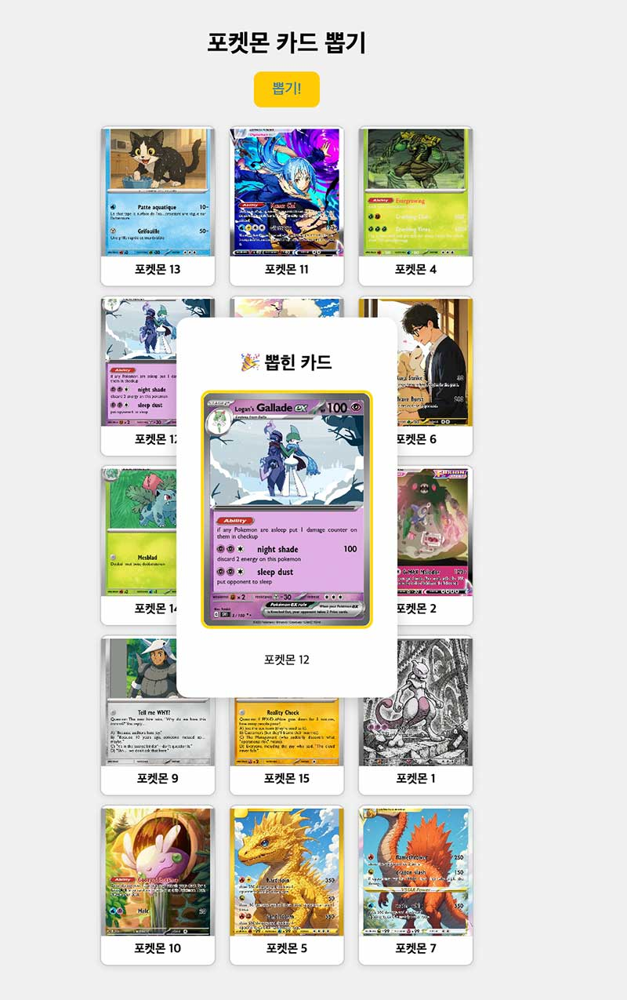
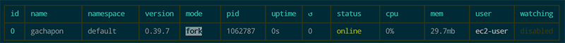

# 포켓몬 카드 가챠 - Next.js 프로젝트

포켓몬 카드 15장을 무작위로 섞고, 하나를 뽑는 가챠 뽑기 웹 앱입니다.
React 19, Next.js 15, SCSS를 사용하여 개발되었습니다.

# 제작배경
아이가 포켓카드 놀이를 좋아하는데, 매번 같이 놀아주기 힘들어서
휴대폰에서 가챠 카드를 뽑아서 대결하는 웹을 만들어봤습니다.
카드는 보유카드를 스캔해서 대체할 예정입니다.

---

## 데모 화면



---

## 주요 기능

- 15장의 포켓몬 카드 표시
- 페이지 로드 후 **5초 뒤 자동 셔플 애니메이션**
- "뽑기!" 버튼 클릭 시 1장 무작위로 선택
- 카드 이미지와 이름 표시
- 반응형 레이아웃 및 간단한 스타일링

---

## 기술 스택

- [Next.js 15.4.5](https://nextjs.org/)
- [React 19.1.0](https://react.dev/)
- [Sass (SCSS)](https://sass-lang.com/)

---

## 폴더 구조
```
pokemon-gacha/
├── components/
│ └── GachaMachine.tsx # 메인 로직 컴포넌트
├── data/
│ └── cards.ts # 포켓몬 카드 리스트 데이터
├── pages/
│ ├── index.tsx # 메인 페이지
│ └── _app.tsx # 글로벌 스타일 적용
├── public/
│ └── pockecard/
│ └── pockemon1.webp ~ pockemon15.webp # 카드 이미지
├── styles/
│ ├── globals.scss # 기본 전역 스타일
│ └── Home.module.scss # 메인 페이지 스타일
├── types/
│ └── card.ts # 카드 타입 정의
├── tsconfig.json
└── package.json
```
## node.js 환경 구성

```bash
#AWS node.js설치
$ curl -o- https://raw.githubusercontent.com/nvm-sh/nvm/v0.39.7/install.sh | bash
#.bashrc 파일추가 확인
export NVM_DIR="$HOME/.nvm"
source "$NVM_DIR/nvm.sh"
$ source ~/.bashrc
# node.js v20 설치
$ nvm install 20
$ nvm use 20
$ nvm alias default 20
#설치 확인
$ node -v   # v20.12.2
$ npm -v    # 10.5.0

#서버 프로세스 관리도구 설치
$ sudo npm install -g pm2

#자동 로딩 설정
$ pm2 startup
$ pm2 save

npm install
```



## 설치 및 실행 방법
```bash
$ npm run build
$ npm run start #문제 확인
$ pm2 start npm --name "gachapon" -- start
```

## 브라우저 확인
```
http://3.35.9.69:3000/
```

## 이미지 명명 규칙
```
image: `/pockecard/pockemon${(i % 15) + 1}.webp`
```