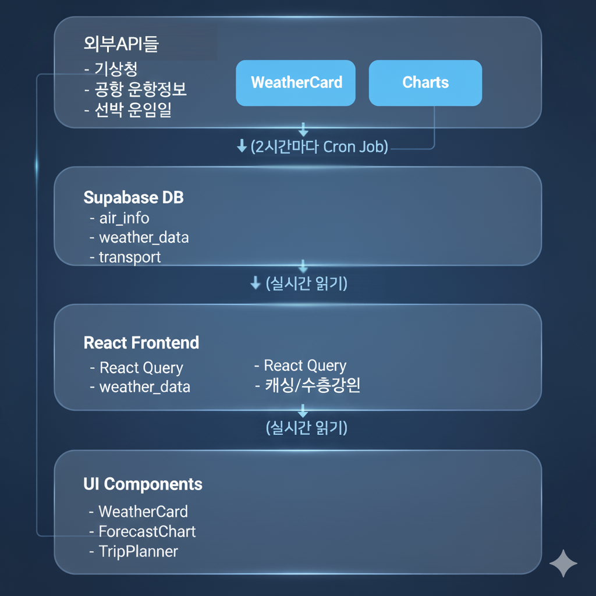
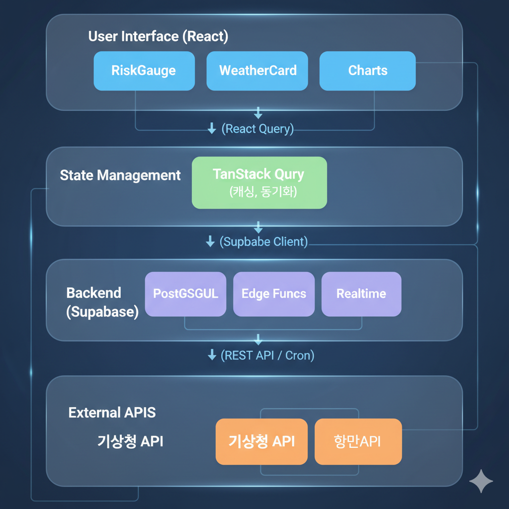

# 제주 고립 확률 예측 서비스

## ① 프로젝트명 / 슬로건

**프로젝트명**: 제주 고립 확률 예측 서비스 (Jeju Island Safe)

**슬로건**: "안전한 제주 여행, 미리 준비하세요"

**서비스 컨셉**:
제주도는 섬이라는 지리적 특성상 기상 악화 시 항공편과 여객선이 운항 중단되어 관광객들이 고립될 수 있습니다. 본 서비스는 실시간 기상 데이터와 교통 운항 정보를 분석하여 제주도 고립 위험도를 0-100% 범위로 예측하고, 여행자들이 안전한 일정을 수립할 수 있도록 돕는 스마트 여행 플래너입니다.

**핵심 가치**:
- **예방적 여행 계획**: 사후 대응이 아닌 사전 예측으로 불편 최소화
- **데이터 기반 의사결정**: 실시간 기상 및 교통 데이터를 통합 분석
- **직관적 시각화**: 복잡한 데이터를 누구나 이해할 수 있는 형태로 제공

---

## ② 문제 정의 & 사용자 대상

### 문제 정의

**핵심 문제**:
1. **예측 불가능한 기상 변화**: 제주도는 해양성 기후로 급격한 기상 변화가 빈번하며, 특히 태풍 시즌(7-9월)과 겨울철 강풍 시기에 고립 사례 발생
2. **분산된 정보**: 기상청, 공항, 항만청 등 여러 기관의 정보를 개별적으로 확인해야 하는 불편함
3. **사후 대응의 한계**: 이미 제주도에 도착한 후 기상 악화로 인한 고립 시 숙박비, 일정 차질 등 경제적·시간적 손실 발생
4. **정보 해석의 어려움**: 풍속, 파고 등 전문 기상 용어를 일반인이 이해하고 여행 결정에 반영하기 어려움

**실제 사례**:
- 2023년 겨울, 강풍으로 제주공항 항공편 200여 편 결항, 수천 명 고립
- 태풍 시즌마다 반복되는 여객선 운항 중단으로 인한 관광객 불편
- 갑작스러운 결항으로 인한 비즈니스 일정 차질 및 추가 비용 발생

### 사용자 대상

**주요 타겟**:

1. **관광객 (개인/가족 여행자)**
   - 연령: 20-50대
   - 특징: 휴가 일정이 정해져 있어 고립 시 업무/학업 복귀 불가
   - 니즈: 안전한 여행 날짜 선택, 대체 일정 수립

2. **비즈니스 출장자**
   - 특징: 중요 회의, 프레젠테이션 등 일정 준수 필수
   - 니즈: 높은 확실성, 리스크 최소화

3. **여행사 및 관광 사업자**
   - 특징: 단체 관광 일정 기획, 다수 고객 책임
   - 니즈: 대규모 일정 변경 리스크 관리, 고객 만족도 유지

4. **제주 거주민 (출도 예정자)**
   - 특징: 육지 방문 시 항공편/여객선 이용
   - 니즈: 출도 및 귀도 일정의 안정성 확보

**사용자 페인 포인트**:
- "주말에 제주도 가려는데 태풍이 올지 모르겠어요"
- "항공편이 결항되면 월요일 출근을 못 해요"
- "여러 사이트를 돌아다니며 날씨와 운항 정보를 확인하는 게 번거로워요"
- "기상 정보를 봐도 실제로 비행기가 뜰지 안 뜰지 판단이 안 돼요"

---

## ③ 해결 아이디어 / 핵심 기능

### 해결 아이디어

**통합 예측 시스템**:
여러 출처의 데이터를 하나의 플랫폼에서 통합하고, 복잡한 기상 데이터를 "고립 확률"이라는 단일 지표로 단순화하여 제공합니다. 사용자는 한눈에 위험도를 파악하고, 7일 예보를 통해 최적의 여행 날짜를 선택할 수 있습니다.

**차별화 포인트**:
- 단순 날씨 정보 제공이 아닌, **실제 교통 운항 가능성**에 초점
- 기상청, 공항, 항만청 데이터를 **실시간 통합 분석**
- 0-100% **정량적 위험도** 제시로 직관적 의사결정 지원
- **7일 예보**를 통한 사전 계획 가능

### 핵심 기능

#### 1. **실시간 고립 위험도 측정**
- **고립 확률 계산 알고리즘**:
  - 풍속 14m/s 이상 → 항공 운항 제한 가능성 ↑
  - 강수량 30mm 이상 → 시정 악화로 운항 차질
  - 파고 2m 이상 → 여객선 운항 중단
  - 각 지표에 가중치를 적용하여 0-100% 확률로 환산

- **4단계 위험도 분류**:
  - 🟢 안전 (0-25%): 정상 운항 예상, 여행 추천
  - 🟡 주의 (26-50%): 경미한 지연 가능성, 예의주시
  - 🟠 경고 (51-75%): 일부 결항 가능성, 대체 일정 검토
  - 🔴 고립 가능 (76-100%): 운항 중단 가능성 높음, 여행 연기 권장

- **데이터 소스**:
  - 기상청 단기예보 API: 풍속, 강수량, 기온
  - 항공기 운항정보 API: 실시간 결항/지연 데이터
  - 선박 운항일정 API: 제주항/성산포항 운항 현황
  - 2시간마다 자동 수집 및 DB 저장

#### 2. **날씨 정보 대시보드**
- **그리드 카드 레이아웃**:
  - 풍속 (Wind): m/s 단위, 14m/s 이상 시 빨간색 경고
  - 강수량 (Rain): mm 단위, 30mm 이상 시 경고
  - 파고 (Wave): m 단위, 2m 이상 시 경고
  - 기온 (Temp): 현재 온도 정보

- **시각적 피드백**:
  - 위험 수준별 배경색 자동 변경
  - Lucide 아이콘으로 직관적 표현
  - 반응형 디자인으로 모바일 최적화

#### 3. **교통 운항 현황**
- **항공 섹션**:
  - 실시간 운항률 (%)
  - 금일 결항편 수
  - 금일 지연편 수
  - 제주국제공항 기준

- **해운 섹션**:
  - 제주항 운항 상태 (정상/지연/중단)
  - 성산포항 운항 상태
  - 여객선사별 운항 현황

#### 4. **7일 예보 차트**
- **인터랙티브 차트 (Recharts)**:
  - Area 차트로 위험도 추세 시각화
  - 날씨 이모지 (☀️🌤️⛅☁️🌧️⛈️) 표시
  - 호버 시 상세 정보 툴팁
  - 안전 기준선 (25%) 표시

- **예측 알고리즘**:
  - 기상청 중기예보 활용
  - 과거 데이터 기반 정확도 개선
  - 신뢰도 수준 함께 표시

#### 5. **여행 계획 도구 (Trip Planner)**
- **날짜 범위 선택**:
  - 시작일/종료일 캘린더 선택
  - 최대 14일 범위 설정 가능

- **위험도 분석**:
  - 여행 기간 평균 위험도
  - 최대 위험도 및 발생 날짜
  - 일별 위험도 상세 보기

- **맞춤형 권장사항**:
  - 평균 위험도 25% 미만: "안전한 여행 예상됩니다"
  - 평균 위험도 25-50%: "일정 변경 가능성에 유의하세요"
  - 평균 위험도 50% 이상: "여행 일정 재검토를 권장합니다"
  - 최고 위험일 하이라이트

---

## ④ 서비스 흐름 / 플로우

### 사용자 여정 (User Journey)

#### **1단계: 접속 및 현황 파악**
```
사용자 접속
    ↓
메인 대시보드 로딩
    ↓
[실시간 고립 확률] 큰 게이지로 즉시 확인
    ↓
현재 위험도 파악 (안전/주의/경고/위험)
```

**화면 구성**:
- 상단: 큰 원형 게이지 (고립 확률 %)
- 위험도 레벨 텍스트 및 색상
- 동적 안전 팁 표시

#### **2단계: 상세 정보 확인**
```
스크롤 다운
    ↓
[날씨 정보] 섹션
    ↓
풍속/강수량/파고/기온 확인
    ↓
[교통 운항 현황] 섹션
    ↓
항공/해운 운항률 및 결항 정보 확인
```

**데이터 흐름**:
```
기상청 API → Supabase (2시간마다 저장)
         ↓
     React Query (캐싱)
         ↓
     UI 컴포넌트 렌더링
```

#### **3단계: 예보 확인 및 여행 계획**
```
[7일 예보 차트] 섹션
    ↓
주간 위험도 추세 확인
    ↓
위험도 낮은 날짜 식별
    ↓
[여행 계획 도구] 섹션
    ↓
출발일/귀가일 선택
    ↓
선택 기간 위험도 분석 결과 확인
    ↓
권장사항 확인
    ↓
여행 결정 (진행/연기/날짜 변경)
```

#### **4단계: 지속적 모니터링**
```
여행 날짜 다가옴
    ↓
정기적 재방문 (D-7, D-3, D-1)
    ↓
위험도 변화 확인
    ↓
필요시 일정 조정
```

### 시스템 아키텍처 플로우


### 데이터 업데이트 주기

- **실시간 데이터**: 2시간마다 외부 API 호출 및 DB 저장
- **프론트엔드 캐싱**: React Query로 5분간 캐싱
- **사용자 화면**: 페이지 방문 시 최신 데이터 자동 로드
- **백그라운드 업데이트**: Supabase Realtime으로 자동 동기화 (선택적)

---

## ⑤ AI 활용 포인트

### 현재 적용된 AI/ML 요소

#### **1. 위험도 예측 알고리즘**
- **기법**: 가중치 기반 스코어링 모델
- **입력 변수**:
  - 풍속 (m/s)
  - 강수량 (mm)
  - 파고 (m)
  - 기온 (°C)
  - 기압 (hPa)

- **가중치 설정** (도메인 전문가 기반):
  ```
  위험도 = (풍속_점수 × 0.4) +
           (강수량_점수 × 0.3) +
           (파고_점수 × 0.3)
  ```

- **임계값**:
  - 풍속 14m/s → 항공 운항 제한 시작점
  - 강수량 30mm → 시정 악화 기준
  - 파고 2m → 여객선 운항 중단 기준

#### **2. 자연어 권장사항 생성**
- **규칙 기반 시스템**:
  ```javascript
  if (riskLevel < 25) {
    return "안전한 여행이 예상됩니다. 즐거운 제주 여행 되세요!";
  } else if (riskLevel < 50) {
    return "경미한 지연 가능성이 있습니다. 여유있는 일정을 권장합니다.";
  } else if (riskLevel < 75) {
    return "운항 차질이 예상됩니다. 대체 일정을 준비하세요.";
  } else {
    return "고립 위험이 높습니다. 여행 연기를 권장합니다.";
  }
  ```

### 향후 AI 고도화 계획

#### **1. 머신러닝 기반 예측 모델**
- **목표**: 과거 데이터 학습을 통한 정확도 향상
- **데이터셋**:
  - 과거 3년간 기상 데이터
  - 실제 결항/지연 기록
  - 고립 발생 사례

- **모델 후보**:
  - Random Forest: 다양한 기상 변수 간 비선형 관계 학습
  - LSTM: 시계열 패턴 학습 (계절성, 주기성)
  - XGBoost: 높은 정확도와 해석 가능성

- **예상 개선**:
  - 현재: 규칙 기반 (정확도 ~70%)
  - 목표: ML 기반 (정확도 ~85-90%)

#### **2. 개인화 추천 시스템**
- **사용자 프로필 학습**:
  - 위험 감수 성향 (보수적 ↔ 공격적)
  - 과거 여행 이력
  - 선호 교통수단 (항공/해운)

- **맞춤형 알림**:
  - "귀하의 성향상 이 날짜는 권장하지 않습니다"
  - "비슷한 여행객들은 이 날짜를 선택했습니다"

#### **3. 챗봇 / 대화형 AI**
- **LLM 통합** (GPT-4, Claude API):
  - 자연어 질의응답: "다음 주말에 제주 가기 안전할까요?"
  - 맞춤형 설명: "왜 이 날은 위험한가요?"
  - 대체 일정 제안: "그럼 언제가 좋을까요?"

- **구현 방식**:
  ```
  사용자 질문 → LLM →
  DB에서 관련 데이터 조회 →
  컨텍스트와 함께 LLM에 재전달 →
  자연스러운 답변 생성
  ```

#### **4. 컴퓨터 비전 (선택적)**
- **위성 이미지 분석**:
  - 구름 패턴 분석으로 기상 변화 조기 감지
  - 태풍 경로 예측 보조

- **공항 CCTV 분석**:
  - 실시간 혼잡도 파악
  - 대기 시간 예측

#### **5. 앙상블 예측**
- **다중 모델 통합**:
  - 기상청 공식 예보
  - 자체 ML 모델 예측
  - 과거 유사 패턴 기반 예측
  - 가중 평균으로 최종 확률 산출

- **신뢰도 구간 제공**:
  - "70% 확률로 안전 (신뢰도: 85%)"
  - 불확실성까지 투명하게 전달

---

## ⑥ 기술 스택

### Frontend Stack

#### **Core Framework**
- **React 18.3.1**
  - 선택 이유: 컴포넌트 재사용성, 풍부한 생태계
  - Virtual DOM으로 효율적 렌더링
  - Hooks 기반 상태 관리

- **TypeScript 5.8.3**
  - 선택 이유: 타입 안정성, 개발 생산성 향상
  - 컴파일 타임 에러 방지
  - IDE 자동완성 지원

- **Vite 5.4.19**
  - 선택 이유: 빠른 HMR, 경량 번들링
  - esbuild 기반 빠른 빌드
  - 개발 서버: 포트 8080

#### **UI & Styling**
- **Tailwind CSS 3.4.17**
  - 선택 이유: 유틸리티 우선, 빠른 프로토타이핑
  - 커스텀 테마: safe/caution/warning/danger 색상
  - JIT 모드로 최적화된 CSS

- **shadcn/ui (Radix UI)**
  - 선택 이유: 접근성 우수, 커스터마이징 용이
  - 사용 컴포넌트: Card, Button, Calendar, Dialog
  - Headless UI로 디자인 자유도 높음

- **Lucide React 0.462.0**
  - 선택 이유: 가볍고 일관된 아이콘 세트
  - Tree-shaking 지원으로 번들 크기 최소화

- **next-themes**
  - 다크모드 지원 (사용자 설정 저장)
  - 시스템 설정 자동 감지

#### **Data & State Management**
- **TanStack React Query 5.83.0**
  - 선택 이유: 서버 상태 관리 특화, 자동 캐싱
  - 기능:
    - 5분 캐싱으로 API 호출 최소화
    - 백그라운드 리페칭
    - 낙관적 업데이트
  - 쿼리 키 전략:
    ```typescript
    ['weather', 'current']
    ['forecast', '7days']
    ['transport', 'status']
    ```

- **React Hook Form 7.61.1**
  - 선택 이유: 성능 최적화, Zod 통합
  - TripPlanner 날짜 입력 폼 관리

- **Zod 3.25.76**
  - 스키마 기반 유효성 검증
  - TypeScript 타입 자동 추론

#### **Visualization**
- **Recharts 2.15.4**
  - 선택 이유: React 네이티브, 선언적 API
  - ForecastChart에서 Area Chart 렌더링
  - 반응형 컨테이너 지원

#### **Utilities**
- **date-fns 3.6.0**
  - 선택 이유: 경량 날짜 라이브러리 (vs Moment.js)
  - 한국어 로케일 지원
  - 트리 쉐이킹 가능

- **Sonner 1.7.4**
  - 토스트 알림 (성공/에러 메시지)

- **Embla Carousel 8.6.0**
  - 터치 친화적 캐러셀 (모바일 최적화)

### Backend & Infrastructure

#### **BaaS (Backend as a Service)**
- **Supabase 2.75.0**
  - 선택 이유: 빠른 개발, PostgreSQL 기반, 실시간 기능
  - 구성 요소:
    - **PostgreSQL**: 관계형 데이터베이스
    - **Row Level Security**: 보안 정책
    - **Realtime**: WebSocket 기반 실시간 동기화
    - **Storage**: 정적 파일 저장 (미래 확장용)

#### **Database Schema**
```sql
-- air_info 테이블 (기상 정보)
CREATE TABLE air_info (
  id UUID PRIMARY KEY DEFAULT gen_random_uuid(),
  icao_code TEXT NOT NULL,           -- 공항 코드 (RKPC: 제주)
  airport_name TEXT,                 -- 공항명
  forecast_time TIMESTAMP NOT NULL,  -- 예보 시간
  wind_direction TEXT,               -- 풍향
  wind_speed NUMERIC,                -- 풍속 (m/s)
  temperature NUMERIC,               -- 기온 (°C)
  pressure NUMERIC,                  -- 기압 (hPa)
  created_at TIMESTAMP DEFAULT now(),
  updated_at TIMESTAMP DEFAULT now()
);

-- 인덱스
CREATE INDEX idx_forecast_time ON air_info(forecast_time);
CREATE INDEX idx_airport ON air_info(icao_code);

-- RLS 정책
ALTER TABLE air_info ENABLE ROW LEVEL SECURITY;
CREATE POLICY "Anyone can read" ON air_info FOR SELECT USING (true);
CREATE POLICY "Service role can insert" ON air_info FOR INSERT
  WITH CHECK (auth.role() = 'service_role');
```

#### **External APIs**
1. **기상청 단기예보 API**
   - URL: `https://apihub.kma.go.kr/api/typ01/url/fct_shrt_reg.php`
   - 인증: API Key 방식
   - 호출 주기: 2시간마다
   - 데이터: 기온, 풍속, 강수량, 습도 등

2. **항공기 운항정보 API**
   - URL: `https://www.airport.co.kr/www/cms/frCon/index.do?MENU_ID=1270`
   - 현황: 공공데이터포털 장애 중
   - 대체: 한국공항공사 Open API 검토 중

3. **선박 운항일정 API**
   - URL: `https://mtisopenapi.komsa.or.kr/eopt/api/oprt-schd-info`
   - 제공: 한국해운조합
   - 데이터: 제주항/성산포항 운항 일정

#### **Data Pipeline**
```
Cron Job (Supabase Edge Functions)
    ↓ (2시간마다)
외부 API 호출
    ↓
데이터 파싱 및 검증
    ↓
Supabase DB 저장
    ↓
React Query 캐시 무효화
    ↓
UI 자동 업데이트
```

### DevOps & Tooling

#### **Version Control**
- **Git / GitHub**
  - 브랜치 전략: main (production), develop (staging)
  - PR 기반 코드 리뷰

#### **Package Manager**
- **npm** (기본)
- **bun** (선택적, 빠른 설치)

#### **Code Quality**
- **ESLint**
  - TypeScript 규칙
  - React Hooks 규칙
  - 사용되지 않는 import 자동 제거

- **Prettier** (선택적)
  - 코드 포맷팅 일관성

#### **Build & Deployment**
- **Vite Build**
  ```bash
  npm run build        # 프로덕션 빌드
  npm run build:dev    # 개발 모드 빌드
  npm run preview      # 로컬 프리뷰
  ```

- **Hosting 옵션**:
  - Vercel (추천): 자동 배포, Edge Network
  - Netlify: 무료 티어
  - Supabase Hosting: 통합 솔루션

#### **Monitoring** (향후 계획)
- **Sentry**: 에러 트래킹
- **Google Analytics**: 사용자 행동 분석
- **Supabase Analytics**: DB 쿼리 성능

### Architecture Diagram


---

## ⑦ 기대효과 / 향후 계획

### 기대효과

#### **1. 사용자 측면**

**경제적 효과**:
- **고립 방지로 인한 비용 절감**:
  - 예상 절감액: 1인당 평균 20-50만원
    - 추가 숙박비: 10-15만원
    - 긴급 항공권/배편: 20-30만원
    - 식비 및 기타: 5-10만원
  - 연간 제주 관광객 1,500만명 중 0.1%만 혜택받아도 30억원 절감

**시간적 효과**:
- 평균 1-3일 일정 차질 방지
- 업무 복귀 지연으로 인한 손실 최소화
- 가족 여행 시 자녀 학업 차질 방지

**심리적 효과**:
- 여행 전 불안감 해소
- 데이터 기반 안심 여행
- 긴급 상황 대응 준비 시간 확보

#### **2. 산업 측면**

**관광 산업**:
- 비수기 수요 예측 가능성 향상
- 여행사 리스크 관리 개선
- 취소율 감소로 운영 효율성 증대

**항공/해운 산업**:
- 승객 문의 감소
- 예약 변경 업무 부담 경감
- 고객 만족도 향상

**지역 경제**:
- 제주도 관광 이미지 개선 ("안전한 여행지")
- 4계절 관광 활성화 (비수기 신뢰도 향상)
- 장기 체류 관광객 증가

#### **3. 사회적 효과**

**공공 안전**:
- 기상 재난 대비 문화 확산
- 데이터 기반 의사결정 장려
- 정보 격차 해소 (고령층도 쉽게 이해)

**환경적 효과**:
- 불필요한 항공편 예약 취소 감소
- 교통수단 효율적 운영
- 탄소 배출 최소화

### 정량적 목표 (1년 후)

| 지표 | 목표 | 측정 방법 |
|------|------|----------|
| 월간 활성 사용자(MAU) | 10만명 | Google Analytics |
| 예측 정확도 | 85% 이상 | 실제 고립 발생 vs 예측 비교 |
| 사용자 만족도 | 4.5/5.0 | 앱 리뷰, 설문조사 |
| 평균 체류 시간 | 5분 이상 | 분석 도구 |
| 재방문율 | 60% 이상 | 쿠키/세션 분석 |

### 향후 계획

#### **Phase 1: MVP 완성 및 베타 런칭** (현재 ~ 3개월)
- [x] 기본 UI/UX 구현
- [x] 실시간 고립 확률 계산
- [ ] 공항/항만 API 연동 완료
- [ ] 7일 예보 정확도 검증
- [ ] 베타 테스터 모집 (100명)
- [ ] 피드백 기반 UX 개선

**목표**: 기본 기능 안정화, 초기 사용자 확보

#### **Phase 2: 기능 고도화** (3-6개월)
- [ ] **머신러닝 모델 도입**:
  - 과거 3년 데이터 수집 및 전처리
  - Random Forest 모델 학습
  - A/B 테스트 (규칙 기반 vs ML 기반)
  - 정확도 85% 이상 달성

- [ ] **개인화 기능**:
  - 사용자 계정 시스템 (소셜 로그인)
  - 여행 이력 저장
  - 맞춤형 알림 설정
  - 즐겨찾기 날짜

- [ ] **모바일 앱 출시**:
  - React Native 기반 iOS/Android 앱
  - 푸시 알림 (위험도 급상승 시)
  - 오프라인 모드 (최근 데이터 캐싱)

- [ ] **다국어 지원**:
  - 영어, 중국어, 일본어
  - 외국인 관광객 타겟팅

**목표**: MAU 5만명 달성, 정확도 개선

#### **Phase 3: 플랫폼 확장** (6-12개월)
- [ ] **다른 섬 지역 확대**:
  - 울릉도, 백령도, 흑산도 등
  - "한국 섬 여행 안전 플랫폼"으로 확장

- [ ] **B2B 서비스**:
  - 여행사 API 제공
  - 기업 출장 관리 시스템 연동
  - 화이트라벨 솔루션

- [ ] **LLM 챗봇 통합**:
  - Claude API 연동
  - 자연어 질의응답
  - 개인화 여행 컨설팅

- [ ] **커뮤니티 기능**:
  - 사용자 리뷰 및 후기
  - 실시간 제주 현장 상황 공유
  - 여행 팁 게시판

**목표**: MAU 10만명, 수익 모델 확립

#### **Phase 4: 수익화 및 확장** (12개월 이후)
- [ ] **수익 모델**:
  - 프리미엄 구독 (광고 제거, 30일 예보)
  - 여행사 제휴 수수료
  - 기업용 API 판매
  - 보험사 제휴 (여행자 보험 추천)

- [ ] **글로벌 확장**:
  - 일본 오키나와, 훗카이도
  - 태국 푸켓, 사무이
  - 그리스 산토리니 등 섬 관광지

- [ ] **AI 고도화**:
  - 위성 이미지 분석
  - 앙상블 예측 모델
  - 설명 가능한 AI (XAI)

- [ ] **생태계 구축**:
  - 제주 지역 관광 업체 통합 플랫폼
  - 숙박, 렌터카, 액티비티 예약 연동
  - 원스톱 여행 플래너

**목표**: 자립 가능한 비즈니스 모델, 지역 사회 기여

### 성공 지표 (KPI)

#### **단기 (3개월)**
- DAU 1,000명
- 앱 평점 4.0 이상
- 버그 리포트 0건/주
- 예측 정확도 75%

#### **중기 (6개월)**
- MAU 50,000명
- 예측 정확도 85%
- 사용자 추천 의향 80%
- 언론 보도 5건 이상

#### **장기 (12개월)**
- MAU 100,000명
- 예측 정확도 90%
- B2B 고객 10곳 확보
- 자체 수익으로 운영비 충당

### 리스크 및 대응 방안

| 리스크 | 영향도 | 대응 방안 |
|--------|--------|-----------|
| API 제공 중단 | 높음 | 다중 데이터 소스 확보, 웹 스크래핑 백업 |
| 예측 부정확 | 높음 | 신뢰도 구간 표시, 면책 문구 명시 |
| 경쟁 서비스 출현 | 중간 | 특화 기능 강화, 커뮤니티 구축 |
| 사용자 성장 정체 | 중간 | 마케팅 강화, 제휴 확대 |
| 서버 비용 증가 | 낮음 | 캐싱 최적화, CDN 활용 |

### 사회 공헌 계획

- **공공 데이터 기여**:
  - 수집한 데이터 정부 제공 (재난 대응)
  - 오픈소스 프로젝트로 전환 (일부 컴포넌트)

- **지역 사회 협력**:
  - 제주 관광공사 협업
  - 지역 소상공인 광고 지원 (무료/저가)

- **교육 및 연구**:
  - 대학 연구 프로젝트 협업
  - 기상 데이터 분석 교육 자료 제공

---

## 결론

**제주 고립 확률 예측 서비스**는 단순한 날씨 앱을 넘어, 데이터 기반 의사결정을 통해 여행자의 안전과 편의를 보장하는 스마트 여행 플랫폼입니다.

**핵심 차별점**:
1. 복잡한 기상 데이터를 **단일 지표**로 단순화
2. 실시간 교통 운항 정보 **통합 제공**
3. **7일 예보**로 최적의 여행 날짜 선택 지원
4. 향후 **AI/ML 고도화**를 통한 지속적 개선

초기 MVP를 시작으로, 머신러닝 기반 예측, 개인화 서비스, 다지역 확장을 거쳐 궁극적으로는 **"모든 섬 여행의 필수 동반자"**로 성장하는 것을 목표로 합니다.

기술적 완성도와 사회적 가치를 동시에 추구하며, 제주도를 넘어 전 세계 섬 관광지로 확장 가능한 확장성 있는 플랫폼을 구축하겠습니다.