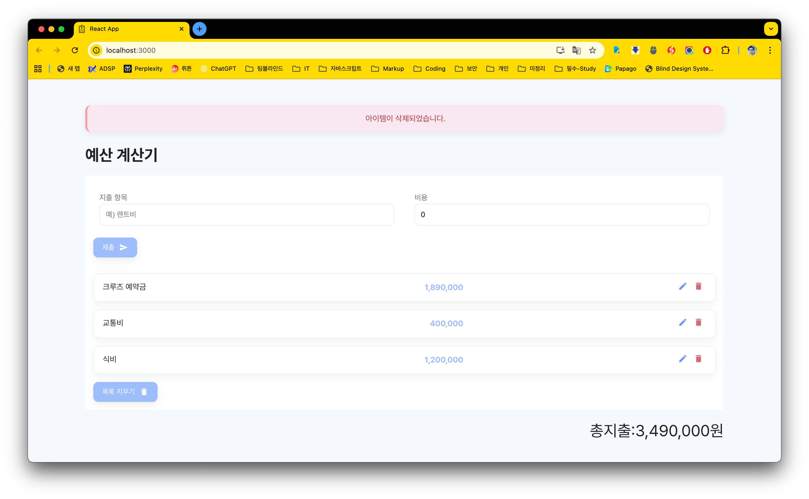

npm install


npm install json-server --save-dev

# React - CRUD 예산 메모장

db.json파일을 이용해서 REST API 개념을 이해하는 과제

# 제작배경
Store에서 이용하지 않고 JSON 파일DB를 이용해서 리프레쉬 또는 서버 재기동시에도 내용이 저장되도록 구현함.

---

## 데모 화면



---

## 주요 기능

- 리액트서버 3000번 포트 pm2 기통
- json-server 3030번 포트를 pm2 기동

---

## 기술 스택

- [React 19.1.0](https://react.dev/)
- [Sass (SCSS)](https://sass-lang.com/)

---

## 설치 및 실행 방법
```bash
$ npm install
$ npm run build
$ npm run start # 리액트 서버 기동
$ npm run server # json-server 기동
```
## 서버기동
```bash
$ pm2 start npm --name "budget" -- start
$ pm2 start npm --name "budgetAPI" -- server
```

## 브라우저 확인
```
http://localhost:3000/
http://3.35.9.69:3000/
```
