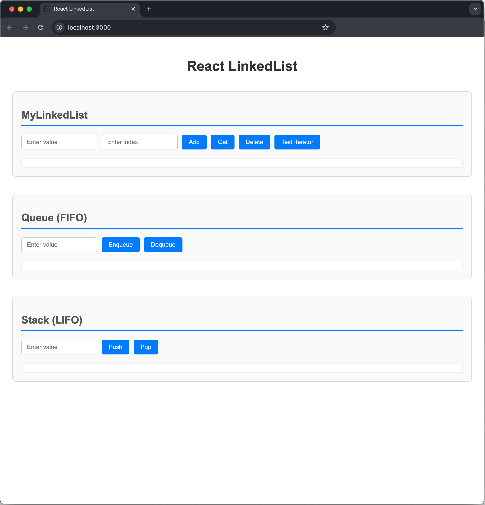

# ICT Honam React LinkedList

연결 리스트(LinkedList)라는 자료구조를 React로 구성
**기차**처럼 데이터들이 하나씩 연결되어 있는 구조

### 1. 연결 리스트 (LinkedList)
- 데이터를 **순서대로** 저장하는 방법
- 마지막에 새로운 데이터 **추가하기**
- 원하는 위치의 데이터 **가져오기**
- 필요없는 데이터 **삭제하기**

### 2. 큐 (Queue)
- **먼저 들어간 것이 먼저 나오는** 구조 (FIFO - First In, First Out)
- **줄서기** 먼저 온 사람이 먼저 나가죠.

### 3. 스택 (Stack)
- **나중에 들어간 것이 먼저 나오는** 구조 (LIFO - Last In, First Out)
- 마치 **책을 쌓는 것** 맨 위에 놓은 책을 먼저 가져가죠.

### Install
```bash
npm install
```
### Run
```bash
npm start
```
### Check
- `http://localhost:3000` 접속

### Server Run
``` bash
# background Launch
$ npm install
$ pm2 start npm --name "linkedlist" -- start
```

### SnapShot


### LinkedList 사용법
1. **글자 입력칸**에 원하는 단어를 써요 (예: "사과", "바나나")
2. **Add 버튼**을 눌러서 리스트에 추가해요
3. **숫자 입력칸**에 번호를 써요 (0부터 시작!)
4. **Get 버튼**을 눌러서 그 위치의 데이터를 확인해요
5. **Delete 버튼**을 눌러서 그 위치의 데이터를 삭제해요
6. **Test Iterator 버튼**을 눌러서 모든 데이터를 순서대로 확인해요

### Queue(큐) 사용법
1. **Enqueue 버튼**: 줄의 **맨 뒤**에 데이터를 추가해요
2. **Dequeue 버튼**: 줄의 **맨 앞**에서 데이터를 꺼내요

### Stack(스택) 사용법
1. **Push 버튼**: 스택의 **맨 위**에 데이터를 추가해요
2. **Pop 버튼**: 스택의 **맨 위**에서 데이터를 꺼내요

## 프로젝트 파일 구조

```
src/
├── Iterator.ts          # 데이터를 하나씩 순회하는 도구
├── MyLinkedList.ts      # 연결 리스트 만들기
├── Queue.ts             # 큐 만들기
├── Stack.ts             # 스택 만들기
├── App.tsx              # 화면에 보이는 부분
├── App.css              # 예쁘게 꾸미는 부분
└── index.tsx            # 프로젝트 시작점
```

### 연결 리스트 실험
1. "사과", "바나나", "포도"를 순서대로 추가해보세요
2. 1번 위치(바나나)를 가져와보세요
3. 0번 위치(사과)를 삭제해보세요
4. Iterator로 남은 데이터들을 확인해보세요

### 큐 실험 (줄서기)
1. "철수", "영희", "민수"를 순서대로 Enqueue해보세요
2. Dequeue를 눌러보세요 → 철수가 먼저 나와요!
3. 다시 Dequeue를 눌러보세요 → 영희가 나와요!

### 스택 실험 (책 쌓기)
1. "수학책", "국어책", "과학책"을 순서대로 Push해보세요
2. Pop을 눌러보세요 → 과학책이 먼저 나와요! (맨 나중에 넣은 것)
3. 다시 Pop을 눌러보세요 → 국어책이 나와요!

- **제네릭(Generic)**: 다양한 타입의 데이터를 저장할 수 있어요
- **Iterator 패턴**: 데이터를 하나씩 순서대로 확인할 수 있어요
- **자료구조**: 데이터를 효율적으로 저장하고 관리하는 방법을 배워요
