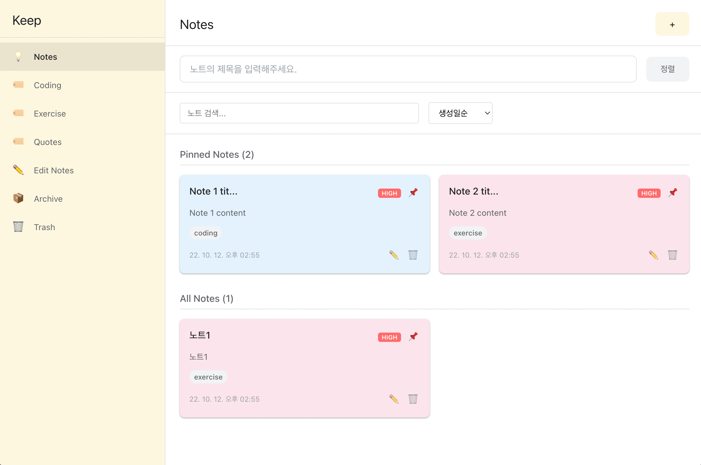
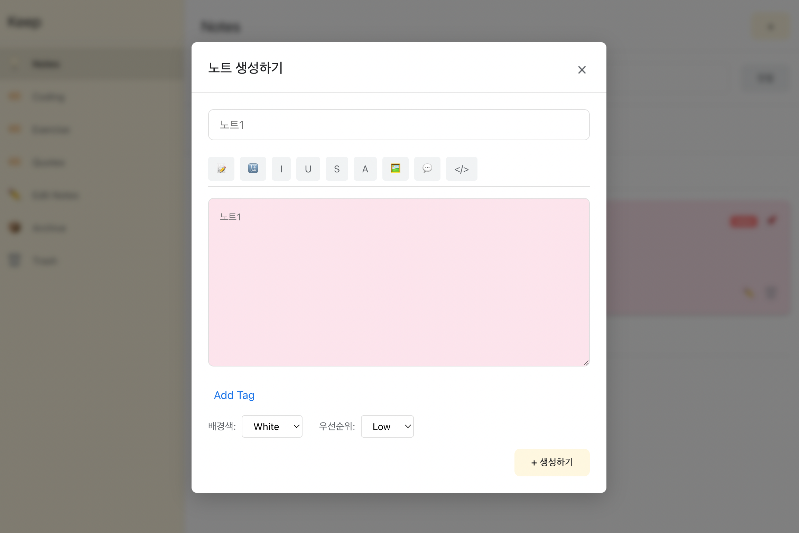
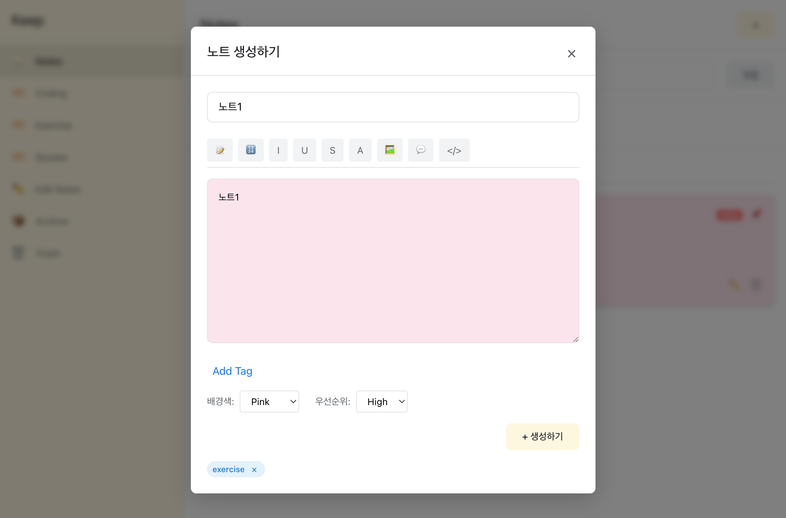
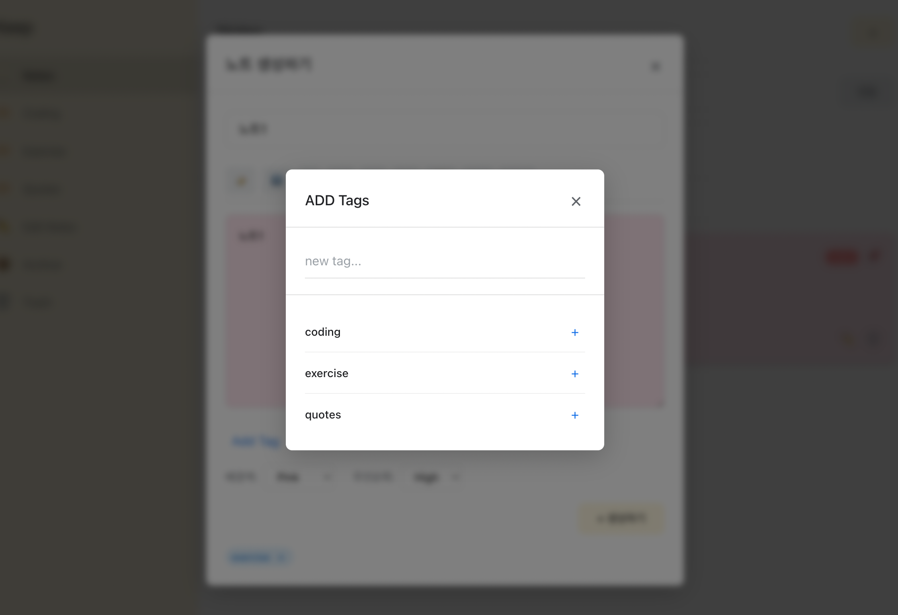

# ICT Note - 노트 앱

노트 관리 애플리케이션입니다.

## 기술 스택

- **React 18** - UI 라이브러리
- **TypeScript** - 타입 안전성
- **Redux Toolkit** - 상태 관리
- **CSS3** - 스타일링

## 주요 기능

- 노트 생성, 수정, 삭제
- 노트 고정/고정 해제
- 태그 시스템
- 노트 색상 변경
- 우선순위 설정 (HIGH/LOW)
- 검색 기능
- 정렬 기능 (생성일, 수정일, 제목, 우선순위)
- 카테고리별 노트 관리
- 반응형 디자인

## 설치 및 실행

1. 의존성 설치:
```bash
npm install
```

2. 개발 서버 실행:
```bash
npm start
```

3. 브라우저에서 `http://localhost:3000` 접속

## 프로젝트 구조

```
src/
├── components/          # React 컴포넌트
│   ├── Layout/         # 레이아웃 컴포넌트
│   ├── Sidebar/        # 사이드바
│   ├── MainContent/    # 메인 콘텐츠
│   ├── NoteCard/       # 노트 카드
│   ├── NotesList/      # 노트 목록
│   ├── NoteInput/      # 노트 입력
│   └── Modals/         # 모달 컴포넌트
├── store/              # Redux 스토어
│   └── slices/         # Redux 슬라이스
├── types/              # TypeScript 타입 정의
├── hooks/              # 커스텀 훅
└── App.tsx             # 메인 앱 컴포넌트
```

## 사용법

1. **노트 생성**: 상단의 "+" 버튼을 클릭하거나 노트 입력 필드에 제목을 입력
2. **노트 편집**: 노트 카드의 연필 아이콘 클릭
3. **노트 삭제**: 노트 카드의 휴지통 아이콘 클릭
4. **노트 고정**: 노트 카드의 핀 아이콘 클릭
5. **태그 추가**: 노트 생성/편집 모달에서 "Add Tag" 버튼 클릭
6. **검색**: 상단의 검색 입력 필드 사용
7. **정렬**: 정렬 드롭다운에서 옵션 선택

## SnapShots




