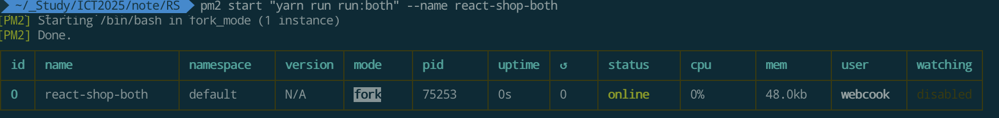

# 리액트 쇼핑몰 서버
생애 첫 리액트 쇼핑몰 프론트엔드, 백엔드 구축하기

## Requirements

- **상품 보기**
- **상품 등록**
- **장바구니**
- **구매하기**
- **검색하기**

## Spec.

### Client
- **React**: javascript를 이용하는 웹사이트 라이브러리
- **TypeScript**: 정적 타입을 지원하는 자바스크립트 확장 언어
- **Material-UI**: React로 빠르게 일관된 디자인을 구현하게 해주는, 구글 머티리얼 디자인 기반 UI 컴포넌트 라이브러리.

### Server
- **Node.js**: 크롬 V8 기반의 서버 사이드 자바스크립트 런타임
- **Express**: 경량·유연한 Node.js 웹 애플리케이션 프레임워크
- **TypeScript**: 정적 타입을 지원하는 자바스크립트 확장 언어

## Install

### Environment
- [Node.js 다운로드](https://nodejs.org/)에서 LTS 버전을 다운로드하고 설치하세요.
- **Yarn** 패키지 관리자 설치
  ```bash
  npm install --global yarn
  ```

### Project Run
- 필요한 라이브러리 설치
  ```bash
  yarn install
  ```

- 서버 실행하기
  ```bash
  yarn run:server
  ```
- 클라이언트 실행하기
  ```bash
  yarn run:client
  ```
- 서버, 클라이언트 동시실행하기
  ```bash
  yarn run:both
  ```
- pm2 띄우기
  ```bash
  pm2 start "yarn run run:both" --name react-shop-both
  ```

- 동작확인
  - 웹 브라우저에서 [http://localhost:3000](http://localhost:3000)
  - 서버는 [http://localhost:3090](http://localhost:3090)

## SnapShots
- npm install Result

  

- Run

  

- pm2 Run

  

## Structure.

```
RS/
├── client/
│   ├── src/
│   │   ├── components/
│   │   ├── pages/
│   │   └── utils/
│   └── public/
└── server/
    ├── src/
    │   ├── routes/
    │   ├── controller/
    │   └── model/
    └── thumbnails/
```
---

- [Express.js 공식 문서](https://expressjs.com/) - 서버 프레임워크에 대해 더 자세히 알아보기
- [Node.js 공식 문서](https://nodejs.org/) - Node.js에 대해 더 자세히 알아보기
